# 商品管理模块测试用例思维导图

> 依据：`AICASS/examples/管理中心/源码/业务功能分析.md`，以及 `icec-cloud-web-system-manager` 中 `product` 包 Controller、Facade、Model 和 `templates/product` 页面模板。
>
> 适用范围：管理中心商品管理相关页面与接口，重点覆盖商品库、类目、品牌、价格库存、商城运营、活动商品、广告公告、售后质保、搜索工具及通用异常场景。

```mermaid
mindmap
  root((商品管理模块测试用例))
    测试准备与通用前置
      账号与权限
        P0 有商品管理菜单权限的运营账号可以进入商品相关页面
        P0 无商品管理权限账号不展示菜单
        P0 无权限账号直接访问商品页面URL被拦截或跳转403
        P1 仅有查询权限账号不可执行新增编辑删除上下架导出等操作
        P1 会话过期后提交查询或保存请求提示重新登录
      基础数据准备
        P0 已上架商品 已下架商品 待审核商品 审核不通过商品
        P0 有库存商品 无库存商品 多仓库存商品
        P0 普通商品 套餐商品 关联商品 OE替换件商品
        P0 一级二级三级业务类目和基础类目映射数据
        P0 可用品牌 停用品牌 重名品牌测试数据
        P1 供应商 门店 区域 客户组 活动 广告位 售后政策数据
      通用页面校验
        P0 页面标题 菜单面包屑 查询区 表格区 操作按钮展示正确
        P0 首次进入页面默认查询条件和默认列表数据正确
        P0 查询条件清空后恢复默认查询结果
        P0 分页首页 末页 上一页 下一页 跳页 每页条数正确
        P1 表格字段排序 展示宽度 空值占位 金额和库存格式正确
        P1 关闭弹窗或返回列表后查询条件和分页状态保留
      通用输入校验
        P0 必填项为空时前端或后端给出明确提示
        P0 超长文本 特殊字符 空格 中文 英文 数字混合输入处理正确
        P0 金额字段只允许合法精度和非负数
        P0 库存字段只允许整数或业务允许的数值范围
        P1 日期时间开始结束范围校验正确
        P1 重复点击保存 删除 上下架不会产生重复数据或重复状态流转
      通用接口异常
        P0 商品服务返回500时页面提示失败且不丢失用户输入
        P0 商品服务超时或网络异常时页面提示可重试
        P1 下游返回空数据时页面展示空态而不是脚本报错
        P1 返回字段缺失或为null时页面可降级展示
        P2 后端日志记录操作人 请求参数 失败原因
    商品列表与详情
      商品列表 productList
        P0 按商品名称模糊查询返回匹配商品
        P0 按商品编号或SKU精确查询返回唯一商品
        P0 按品牌筛选返回该品牌商品
        P0 按业务类目筛选返回该类目及约定子类目商品
        P0 按商品状态筛选已上架 已下架 待审核 审核拒绝商品
        P1 按供应商或门店维度筛选商品
        P1 多条件组合查询结果同时满足所有条件
        P1 查询无结果时展示无数据提示
        P1 非法商品编号查询不报错
      商品详情 productDetail
        P0 从商品列表点击详情可以进入正确商品详情页
        P0 基本信息展示商品名称 编号 品牌 类目 状态
        P0 图片 属性 OE号 适配车型或配件信息展示正确
        P0 套餐或关联商品展示关联明细
        P1 商品不存在或已删除时提示记录不存在
        P1 详情页返回列表不丢失原查询条件
      商品状态 productStatusList
        P0 状态列表展示商品当前状态和历史状态
        P0 上架商品状态展示为可售或已上架
        P0 下架商品状态展示为不可售或已下架
        P1 状态更新时间 操作人 审核信息展示正确
        P1 状态字段为空或未知枚举时页面显示兜底文案
      价格库存 priceAndInventoryInfo
        P0 商品价格展示正确并保留业务要求精度
        P0 多仓库存按仓库或区域展示正确
        P0 无库存商品展示0或缺货状态
        P1 促销价 会员价 区域价 优先级展示符合配置
        P1 价格为0 负数 超大金额等异常数据被拦截或提示
        P1 库存并发变化后刷新页面展示最新数据
      发票历史 invoiceHistoryList
        P1 商品发票历史按时间倒序展示
        P1 按商品编号查询发票记录正确
        P1 无发票历史时展示空态
        P2 发票历史字段缺失时页面不报错
    类目管理
      类目树 businessCategory
        P0 类目管理页加载一级 二级 三级类目树
        P0 展开和收起类目节点正常
        P0 选中类目后右侧详情同步刷新
        P1 大量类目加载时页面响应可接受
        P1 无子类目节点展示叶子节点状态
      类目搜索 categorySearch
        P0 按类目名称搜索返回匹配类目
        P0 按类目编码搜索返回目标类目
        P1 模糊搜索 高亮或定位结果正确
        P1 搜索无结果时展示提示
      新增类目 addCategory
        P0 新增一级类目成功
        P0 新增子类目成功并挂载到正确父类目
        P0 类目名称为空保存失败
        P0 同级类目名称重复保存失败或按业务规则提示
        P1 类目排序值为空 非数字 重复时校验正确
        P1 类目图片上传格式 大小 尺寸校验正确
      编辑类目 categoryDetail
        P0 修改类目名称后列表和详情同步更新
        P0 修改类目状态后商品筛选可见性符合预期
        P1 修改父类目时不允许形成循环层级
        P1 编辑保存失败时原类目信息不被覆盖
      类目属性与图片
        P0 新增类目属性成功
        P0 修改类目属性成功
        P0 删除类目属性后不再展示
        P0 属性名称重复时提示
        P1 类目图片新增 修改 删除 查询正确
        P1 被商品使用的类目属性删除需按规则拦截或提示影响范围
      类目差异与引导
        P1 类目差异页面展示新旧类目映射差异
        P1 类目引导页面按业务规则推荐映射类目
        P1 类目变更记录展示操作人 时间 变更内容
        P2 差异数据为空时展示无差异状态
      businessCategoryV2
        P0 V2类目树加载和搜索正常
        P0 V2新增 编辑 详情功能可用
        P1 V1和V2相同数据展示一致
        P1 V1和V2差异数据在差异页可识别
    品牌管理
      品牌列表 brandList
        P0 进入品牌列表页面加载品牌数据
        P0 按品牌名称查询正确
        P0 按品牌编码或首字母查询正确
        P1 按启用停用状态筛选正确
        P1 分页 刷新 清空条件正确
      新增品牌 addBrand
        P0 输入合法品牌名称和必填信息新增成功
        P0 品牌名称为空保存失败
        P0 重复品牌名称保存失败或提示重复
        P1 品牌Logo上传格式 大小校验正确
        P1 品牌排序和状态保存正确
      修改品牌 updBrand
        P0 修改品牌名称后商品详情和列表展示新名称
        P0 修改品牌启停用状态成功
        P1 停用品牌不可被新增商品或配置选择
        P1 编辑失败后列表数据不发生变化
      品牌关联与质量服务
        P1 品牌质保或质量服务配置查询正确
        P1 品牌与配件关系保存后可查询
        P2 品牌关系操作记录可追溯
    商城商品运营
      商城管理 mallManagerList
        P0 商城商品列表加载成功
        P0 按商品名称 编号 类目 品牌 状态查询正确
        P0 商品上下架或展示状态变更成功
        P1 状态变更后前台或接口可查询到最新状态
        P1 操作失败时页面提示原因并保持原状态
      审核记录 productAuditRecordList
        P0 查询商品审核记录展示审核状态
        P0 审核记录展示审核人 审核时间 审核意见
        P1 多条审核记录按时间倒序展示
        P1 无审核记录时展示空态
      特殊销售 spacialSaleManagerList
        P0 特殊销售商品列表查询正确
        P0 新增特殊销售配置成功
        P0 编辑特殊销售配置生效
        P1 重复配置同一商品或同一范围时按规则拦截
        P1 特殊销售起止时间 状态 范围校验正确
    商品活动管理
      活动候选商品 activity addProducts optionalProductList
        P0 按商品名称 编号 类目 品牌搜索候选商品
        P0 选择单个商品加入活动成功
        P0 批量选择商品加入活动成功
        P0 已加入活动商品不可重复加入或提示重复
        P1 下架或无库存商品是否可加入活动符合规则
      活动商品展示 products showProducts
        P0 活动商品列表展示活动价 库存 排序 状态
        P0 从活动商品列表移除商品成功
        P1 活动商品分页和多条件查询正确
        P1 活动商品数据为空时展示空态
      拖拽排序 dragItemSort
        P0 拖拽商品后排序保存成功
        P0 刷新页面后排序结果保持
        P1 多人同时排序时后保存结果按规则处理
        P1 排序保存失败时前端回滚或提示刷新
      团购活动 groupBuyList groupBuyForm groupBuyCheck
        P0 创建团购活动并选择商品成功
        P0 团购活动审核通过后状态正确
        P0 审核拒绝后展示拒绝原因
        P1 团购时间 库存 人数 价格边界校验正确
        P1 团购统计页数据口径正确
      预约活动 booking
        P1 预约活动列表查询正确
        P1 新增或编辑预约活动配置成功
        P1 活动状态启用 停用 过期展示正确
        P2 开始时间晚于结束时间时保存失败
      抽奖 红包 礼品
        P1 抽奖活动列表 新增 编辑 基础设置保存正确
        P1 奖品列表 奖品配置 奖池配置 规则配置正确
        P1 红包配置按询价和订单场景分别保存
        P1 礼品管理页面加载和查询正确
        P2 奖品库存不足或中奖概率非法时校验正确
    价格与销售范围
      商品定价 productPricing
        P0 定价列表按商品 类目 品牌 区域查询正确
        P0 新增商品定价保存成功
        P0 编辑商品定价后详情展示最新价格
        P0 删除或停用定价后不再命中销售价格
        P1 区域价 客户价 类目价优先级符合业务规则
        P1 价格区间边界值保存和查询正确
      销售范围 salesScope
        P1 按区域配置商品销售范围成功
        P1 特殊销售范围配置和普通销售范围不冲突
        P1 不在销售范围内的区域查询不到可售商品
        P2 区域树加载失败时提示明确
      采购包与库存 stock
        P1 采购包列表查询正确
        P1 采购包商品明细展示正确
        P1 协议商品库存展示正确
        P2 库存数据更新后页面刷新可见
    广告 公告 楼层 推荐
      广告 advertisement
        P0 广告列表加载和查询正确
        P0 新增广告保存成功
        P0 编辑广告后列表和详情展示最新内容
        P0 查看广告详情正确
        P1 广告图片 链接 跳转商品 活动时间校验正确
        P1 删除或下线广告后不再展示有效状态
        P2 广告统计数据展示正确
      公告 announcement
        P0 公告列表加载正确
        P0 新建公告成功
        P0 公告预览和预览详情展示正确
        P1 公告启用 停用 编辑 删除状态正确
        P1 公告标题 内容 时间范围必填和长度校验正确
      楼层 portalFloor
        P1 首页楼层列表查询正确
        P1 PC楼层新增 编辑 预览保存正确
        P1 APP楼层上方 下方配置保存正确
        P1 楼层关联商品 类目 广告位后展示正确
        P2 楼层排序调整后刷新保持
      店铺激活与推荐
        P1 店铺激活列表查询正确
        P1 店铺激活配置保存成功
        P1 店铺推荐新增 编辑 查询正确
        P2 推荐排序和启停用状态正确
      竞价排序 biddingsort
        P1 竞价排序配置保存成功
        P1 配置历史展示操作人 时间 内容
        P2 异常排序值和重复排序值校验正确
    售后 质保 赔付
      售后查询 afterSaleQueryManager
        P0 售后查询列表按订单 商品 用户 状态查询正确
        P0 售后信息详情展示商品和服务信息
        P1 售后记录列表按时间倒序展示
        P1 售后状态为空或未知时页面兜底展示
      特殊售后 specialAfterSaleManager
        P1 特殊售后服务列表加载正确
        P1 售后服务配置新增 编辑 删除正确
        P1 售后品类配置保存正确
        P1 额外配件配置保存正确
        P2 配置冲突或重复时提示明确
      质保 warranty
        P1 质保列表查询正确
        P1 新增质保政策成功
        P1 编辑质保政策成功
        P1 质保启用 停用状态生效
        P2 质保周期 适用品类 品牌范围边界校验正确
      赔付 compensation
        P1 赔付列表查询正确
        P1 新增赔付规则成功
        P1 编辑赔付规则成功
        P1 赔付启用 停用状态生效
        P2 赔付金额 比例 上限 下限校验正确
    搜索 工具 导入导出
      商城搜索 mallsearchmanager
        P1 热词列表查询 新增 编辑 删除正确
        P1 同义词列表查询和Excel上传正确
        P1 分词列表查询和Excel上传正确
        P1 语义分析输入关键词返回分析结果
        P2 搜索配置操作记录展示正确
      OE替换件 oereplacepart
        P0 OE替换件列表查询正确
        P1 新增或编辑替换件关系后商品详情可见
        P1 重复OE关系或循环替换关系按规则拦截
        P2 删除替换关系后查询不到旧关系
      商品导出 exportExcel
        P0 按当前查询条件导出商品Excel
        P0 导出字段与列表或需求字段一致
        P1 大数据量导出有进度或后台任务提示
        P1 无数据导出时生成空表或提示无数据
        P2 导出失败时提示原因且不生成损坏文件
      批量导入 oncall download
        P1 商品信息批量导入成功
        P1 商品价格批量更新成功
        P1 商品库存批量更新成功
        P1 安全库存批量更新成功
        P1 品牌件号关系批量导入成功
        P1 套餐关系批量导入成功
        P2 模板列缺失 数据类型错误 重复行时错误报告准确
      二维码工具 qrcode
        P2 输入合法内容生成二维码
        P2 空内容或超长内容生成失败并提示
    接口 权限 安全专项
      Web聚合层接口
        P0 Controller正确调用对应Feign服务并透传必要参数
        P0 Feign返回成功时页面展示返回数据
        P0 Feign返回业务失败时页面展示业务错误信息
        P1 下游服务返回分页总数和列表不一致时页面处理正确
        P1 重试或刷新不会产生重复新增和重复状态变更
      权限与审计
        P0 查询 新增 编辑 删除 上下架 导出分别校验按钮和URL权限
        P0 越权访问接口返回403或业务禁止
        P1 操作日志记录模块 操作类型 操作对象 操作人
        P2 敏感操作需要确认弹窗或二次校验
      安全测试
        P0 商品名称 品牌 类目 公告 广告内容输入脚本不会执行
        P0 文件上传限制扩展名 MIME 大小和内容
        P1 导出文件避免公式注入
        P1 URL参数非法ID SQL关键字 特殊字符不会导致异常泄露
        P1 GET删除或状态变更接口需要校验幂等和CSRF风险
        P2 页面错误信息不暴露堆栈 内部服务名 密钥或配置
    非功能测试
      兼容性
        P1 Chrome Edge 常用分辨率下页面布局正常
        P1 表格列多 数据长文本 弹窗小屏展示不遮挡
        P2 浏览器缩放后查询区和按钮可用
      性能
        P1 商品列表常规查询响应在可接受范围
        P1 类目树大量节点加载可接受
        P1 导出大数据量不阻塞页面主流程
        P2 高频查询不会导致页面卡死或接口过载
      可用性
        P1 保存成功 失败 删除确认 上下架确认提示清晰
        P1 表单校验定位到具体字段
        P1 弹窗关闭 返回 刷新后状态符合用户预期
        P2 空态 加载态 错误态文案一致
      数据一致性
        P0 商品状态变更后列表 详情 商城管理 活动商品同步
        P0 品牌或类目变更后商品列表和详情同步
        P1 定价或库存变更后价格库存页同步
        P1 活动商品排序和商城楼层推荐展示一致
        P2 缓存延迟场景有刷新或最终一致性说明
```

## 覆盖模块对照

| 测试范围 | 代码或页面线索 |
| --- | --- |
| 商品列表、详情、状态、价格库存、发票历史 | `product/products`，`templates/product/products/*.ftl` |
| 类目管理 | `product/category`，`templates/product/businessCategory`，`templates/product/businessCategoryV2` |
| 品牌管理 | `product/brand`，`templates/product/brand/*.ftl` |
| 商城运营与特殊销售 | `product/mallManager`，`templates/product/mallmanager/*.ftl` |
| 活动商品、团购、预约、抽奖、红包、礼品 | `product/activity`，`product/activitytemplate`，`product/groupPurchase`，`product/booking`，`product/lotterydrawmanager`，`product/redpacket`，`product/gifts` |
| 价格、库存、销售范围 | `product/pricing`，`product/stock`，`product/sales` |
| 广告、公告、楼层、推荐、竞价排序 | `product/advertisement`，`product/announcement`，`product/portalFloor`，`product/storerecommand`，`product/biddingsort` |
| 售后、特殊售后、质保、赔付 | `product/aftersalequery`，`product/specialAfterSale`，`product/warranty`，`product/compensation` |
| 搜索、OE替换件、导出、批量导入、工具 | `product/mallsearchmanager`，`product/replancepart`，`product/excelDown`，`product/oncall`，`product/tools` |
